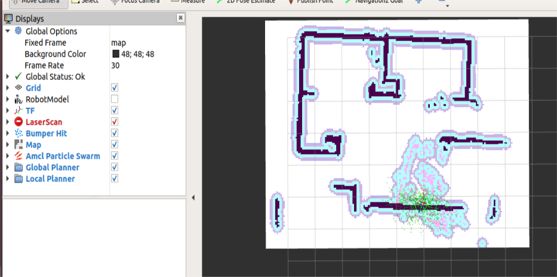

# Visualization with Nav2 and Rviz for mapping and localization 

## Introduction
This project is intended to demonstrate the visualization with Nav2 and Rviz for mapping and localization on Qualcomm Robotics platform RB5. 

## Prerequisites 
- A Linux host system with Ubuntu 18.04. 
- Install Android Platform tools (ADB, Fastboot)  
- Download and install the SDK Manager for RB5 
- Flash the RB5 firmware image on to the RB5 
- Setup the Network on RB5. 
- Installed python3.6 on RB5 
- Installed python3.6 on host system 
- Installed ros-dashing-desktop-full on RB5 
- Installed ros-dashing-desktop-full on host system 

##   Installing Dependencies 
### Install dependent ROS2 packages on host system 
 
1. Install Colcon 
```sh
$ sudo apt install python3-colcon-common-extensions 
```
 

2. Install Cartographer 
```sh
$ sudo apt install ros-dashing-cartographer 
$ sudo apt install ros-dashing-cartographer-ros 
```
 

3. Install Navigation2 
```sh
$ sudo apt install ros-dashing-navigation2 
$ sudo apt install ros-dashing-nav2-bringup 
```
 

4. Install vcstool 
```sh
$ sudo apt install python3-vcstool 
```
 


### Setup Workspace 
1. Creating new directory for TurtleBot 3 
```sh
$ mkdir -p ~/turtlebot3_ws/src && cd ~/turtlebot3_ws/src 
```
 

2. Clone necessary repositories & accessing TurtleBot Folder 
```sh
$ git clone -b dashing-devel https://github.com/ROBOTIS-GIT/hls_lfcd_lds_driver.git 
$ git clone -b dashing-devel https://github.com/ROBOTIS-GIT/turtlebot3_msgs.git 
$ git clone -b dashing-devel https://github.com/ROBOTIS-GIT/turtlebot3.git 
$ git clone -b dashing-devel https://github.com/ROBOTIS-GIT/DynamixelSDK.git 
```

3. Source the TurtleBot3 Setup file 
```sh
$ cd ~/turtlebot3_ws/src/turtlebot3 
$ export ROS_DOMAIN_ID=30 
$ export TURTLEBOT3_MODEL=burger 
$ source /opt/ros/dashing/setup.bash 
```

4. Build the Turtlebot packages 
```sh
cd ~/turtlebot3_ws/ 
colcon build 
source ~/turtlebot3_ws/install/setup.bash 
```
 
### Map Generation 
 
1. To enter RB5 shell open new terminal on host system and run below command 
```sh
$ ssh root@<IP_ADDRESS> 
```
 
2. After entering in RB5 shell run bring up command, Source the workspace and launch bring up command 
```sh
sh4.4 export ROS_DOMAIN_ID=30 
sh4.4 export TURTLEBOT3_MODEL=burger 
sh4.4 source /opt/ros/dashing/setup.bash 
sh4.4 ros2 launch turtlebot3_bringup robot.launch.py 
```
3. Open a new terminal from host system source environment and launch the SLAM node. The Cartographer is used as a default SLAM method.  
```sh
$ export ROS_DOMAIN_ID=30 
$ export TURTLEBOT3_MODEL=burger 
$ source /opt/ros/dashing/setup.bash 
$ ros2 launch turtlebot3_cartographer cartographer.launch.py 
```
 Once SLAM node is successfully up and running, TurtleBot3 will be exploring unknown area as shown in image below.  


4. To explore your area completely open RB5 shell and source workspace and launch teleop node. 
```sh
sh4.4 export ROS_DOMAIN_ID=30 
sh4.4 export TURTLEBOT3_MODEL=burger 
sh4.4 source /opt/ros/dashing/setup.bash 
sh4.4 ros2 run turtlebot3_teleop teleop_keyboard 
```
As show in image below 
Keyboard shortcuts w, a, x, s, d is used to move the bot and to every corner of the map. 

w and x: for linear velocity 

a and d: Angular velocity 

s: stop  


5. After analyzing complete map on host system save the map using below command 
```sh
$ ros2 run nav2_map_server map_saver -f ~/map  
```
 
- Below image is the sample map generated. Black portion is a walls or obstacles, white portion is free space. 

 


### Navigation
1. On RB5 shell, Source the workspace and launch bring up command 
```sh
sh4.4 export ROS_DOMAIN_ID=30 
sh4.4 export TURTLEBOT3_MODEL=burger 
sh4.4 source /opt/ros/dashing/setup.bash 
sh4.4 ros2 launch turtlebot3_bringup robot.launch.py 
```

2. On host system source the workspace and launch navigation command  
```sh
$ export ROS_DOMAIN_ID=30 
$ export TURTLEBOT3_MODEL=burger 
$ source /opt/ros/dashing/setup.bash 
$ ros2 launch turtlebot3_navigation2 navigation2.launch.py map:=/home/map.yaml 
```
Running this command will open visualization with map provided as shown in image below. 


Initial Pose Estimation must be performed before running the Navigation as this process initializes the AMCL parameters that are critical in Navigation. TurtleBot3 has to be correctly located on the map with the LDS sensor data that neatly overlaps the displayed map. 

To set initial position, Click the 2D Pose Estimate button in the RViz2 menu. 

Click on the map where the actual robot is located and drag the large green arrow toward the direction where the robot is facing. 



 

 

 

 

To navigate bot, set the goal by clicking on Click the Navigation2 Goal button in the RViz2 menu.  

To get coordinates of current position, In RViz2, click on TF->Base Footprint-> copy Position and orientation values and use it for navigation. 

 


 

Fetch the coordinates from the goal point (Kitchen, hall, outdoor, Room, initial position, parking) by placing the robot in different places. 

 

To test navigation by using coordinates run below command in host system 
```sh
$ ros2 action send_goal /NavigateToPose nav2_msgs/action/NavigateToPose "pose: {header: {frame_id: map}, pose: {position: { x: 0.0: ,y: 0.0 ,z:0.0}, orientation: {x: 0.0,y: 0.0,z: 0.0,w: 0.0}}}" 
```
 
Replace values for position and orientation for each coordinate. 

 
 ###Usage
1. On RB5 shell, Source the workspace and launch bring up command 
```sh
sh4.4 export ROS_DOMAIN_ID=30 
sh4.4 export TURTLEBOT3_MODEL=burger 
sh4.4 source /opt/ros/dashing/setup.bash 
sh4.4 ros2 launch turtlebot3_bringup robot.launch.py 
```
 

2. On host system source the workspace and launch navigation command  
```sh
$ export ROS_DOMAIN_ID=30 
$ export TURTLEBOT3_MODEL=burger 
$ source /opt/ros/dashing/setup.bash 
$ ros2 launch turtlebot3_navigation2 navigation2.launch.py map:=/home/map.yaml 
```
4. On host system send navigation goal to navigate bot 
```sh
$ ros2 action send_goal /NavigateToPose nav2_msgs/action/NavigateToPose "pose: {header: {frame_id: map}, pose: {position: { x: 2.2285,y: -1.4418,z: 0.0}, orientation: {x: 0.0,y: 0.0,z: 0.621925,w:0.783091}}}"
 
```
- Note: Replace values for position(x,y,z) and orientation(x,y,z,w) for each coordinate. 

 

 
